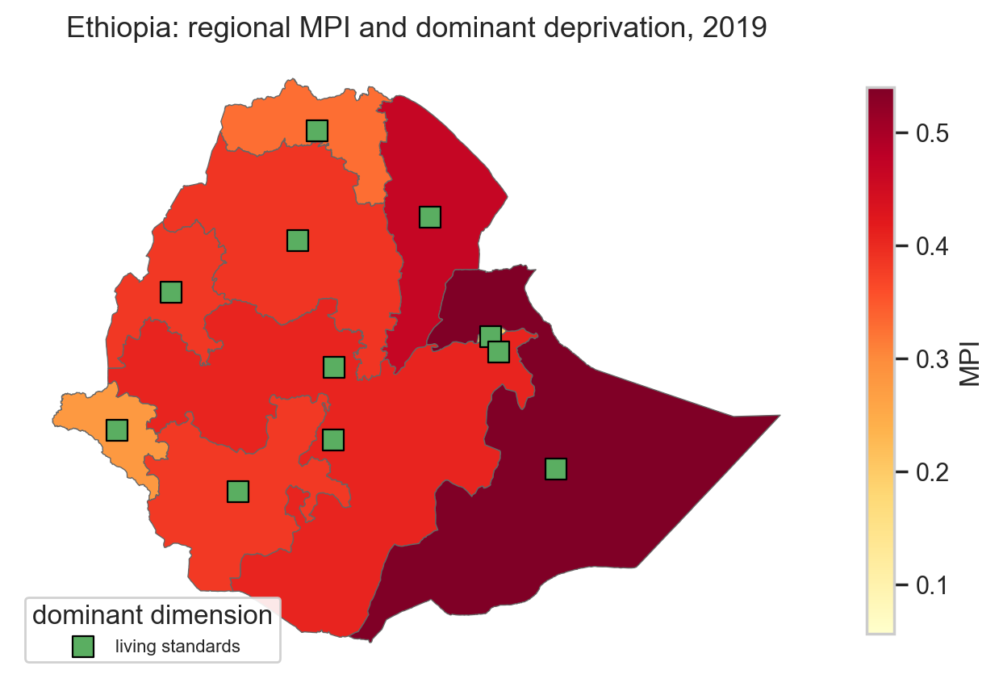

# Multidimensional poverty in Ethiopia

> Beyond income, which bundles of deprivation cluster together in Ethiopia — and where?



## The question

Income poverty is the dominant measure but not the only one — and in lower-resource settings, the income line miscounts in both directions. The Multidimensional Poverty Index (MPI), developed by OPHI and adopted by the UNDP, instead asks: across health, education, and living standards, how many *deprivations* does a household face, and how intense is that bundle? This project applies the OPHI MPI methodology to Ethiopia using the most recent DHS wave, decomposes the result by region and by deprivation dimension, and adds an ML feature-importance step (Random Forest / XGBoost + SHAP) to identify which household characteristics most predict MPI status. We are **not** comparing Ethiopia to other countries (that requires harmonized cross-country MPI, a different exercise), and we are **not** building a poverty-targeting tool (that requires program design, ethics review, and validation that this study does not perform).

## Data

| Source | Granularity | Time coverage | Access |
|--------|-------------|---------------|--------|
| [DHS Ethiopia (most recent wave)](https://dhsprogram.com/data/dataset/Ethiopia_Standard-DHS_2019.cfm) | Household + individual; clusters + strata + weights | 2019 wave (most recent) | **Registered (free); license forbids redistributing raw microdata** |
| [OPHI Global MPI methodology](https://ophi.org.uk/multidimensional-poverty-index/) | Methodology + indicator definitions | — | Public |
| [GADM 4.1 administrative boundaries](https://gadm.org/) | Ethiopia admin-1 (region) polygons | Current | Public |

Access date: planned 2026-05-XX (to be filled when ingestion notebook is first run). Raw DHS microdata is **not committed**; the repo contains derived analytic files only.

## Method

The OPHI MPI is computed in three steps. **(1) Indicators**: for each household, compute the 10 OPHI deprivation indicators across health (child mortality, nutrition), education (years of schooling, school attendance), and living standards (cooking fuel, sanitation, drinking water, electricity, housing, assets). **(2) Weighted deprivation count**: weight each indicator per OPHI methodology and sum to a per-household deprivation score. **(3) Headcount and intensity**: a household is "multidimensionally poor" if its weighted deprivation score is ≥ k (default k=1/3); the MPI is then (headcount) × (average intensity among the poor). All steps use **DHS survey design** — clusters, strata, and sampling weights — so that the estimates are nationally and regionally representative. Onto that we layer two extensions: (a) a decomposition by region and by deprivation dimension showing which dimension drives MPI in which region, and (b) a Random Forest / XGBoost classifier predicting MPI status from a wider set of household characteristics, with SHAP values surfacing which features matter most. The strongest critique of this approach is that the OPHI weighting and the k threshold are themselves choices — different reasonable choices give different headlines — so sensitivity to both is shown explicitly.

## Methodological decisions

Each major data-processing decision was made by **diagnostic first, choice second**. The table below is an at-a-glance summary; the full five-part rationale (problem / diagnostic / options / decision + rationale / sensitivity) lives inline in `notebooks/02_main.ipynb`.

| Decision | Chose | Why (anchored in diagnostic) | Sensitivity |
|----------|-------|------------------------------|-------------|
| Treatment of missing indicator items (drop household vs. impute vs. compute partial MPI) | *to be filled during implementation* | *anchored in diagnostic — see notebook §4* | *to be filled* |
| Poverty cutoff k (OPHI default 1/3 vs. alternatives) | *to be filled during implementation* | *anchored in diagnostic — see notebook §5* | *to be filled* |
| Survey-design handling (clusters + strata + weights — non-negotiable; how implemented) | *to be filled during implementation* | *anchored in DHS sampling-design diagnostic — see notebook §3* | *to be filled* |
| ML feature selection (which household characteristics enter the Random Forest / XGBoost) | *to be filled during implementation* | *anchored in diagnostic — see notebook §7* | *to be filled* |
| Train/test split respecting survey design (no household leakage across clusters between folds) | *to be filled during implementation* | *anchored in clustered-CV diagnostic — see notebook §7* | *to be filled* |
| SHAP interpretation: aggregating SHAP values across households given sampling weights | *to be filled during implementation* | *anchored in diagnostic — see notebook §7* | *to be filled* |

> Brand note: every choice above is an *educated* decision, not a convention. If you'd defend it differently, the diagnostic data is in the notebook — read it and tell me where I'm wrong.

## Findings

*To be filled during implementation. Each finding will be a falsifiable statement anchored in a specific number from the analysis (e.g., "Ethiopia's national MPI is X with k=1/3; region Y has the highest headcount at Z%; the dominant deprivation in region Y is W").*

## Limitations

*To be filled during implementation. Expected categories: DHS waves are infrequent (2019 wave precedes recent shocks), MPI weights and k are themselves methodological choices not empirical findings, regional aggregates mask within-region heterogeneity, the ML feature-importance step describes association not causation, and rural / urban definitions in DHS are coded at the cluster level which introduces some misclassification.*

## Visual style

This project uses **matplotlib + seaborn** for the regional MPI map (hero), the decomposition stacked bars by dimension and region, the SHAP summary plot, and the robustness panels. Justification: this is a survey-methods-and-ML project where the rigor signal benefits from a static publication look; SHAP summary plots and decomposition bars are static-by-nature, and the regional MPI choropleth needs to land cleanly in a static recruiter-facing notebook. No interactive drill-down is part of the deliverable.

## How to reproduce

```bash
git clone <url>
cd 04-ethiopia-poverty-mpi

# Install with the survey + ML + viz extras
pip install -e ".[viz,survey,ml]"

# Place DHS microdata files in data/raw/ (see data/raw/README.md)
# Raw DHS data is NOT committed — you must register with DHS and download separately.

# Run the main notebook
jupyter lab notebooks/02_main.ipynb
```

Full run time: ~X minutes (DHS extraction is the slow step; cached after first run).

## Files

- `notebooks/02_main.ipynb` — the analysis (start here)
- `notebooks/03_robustness.ipynb` — sensitivity checks for k, for indicator-missingness handling, and for clustered cross-validation
- `src/ethiopia_mpi/data.py` — DHS extraction + GADM loader (no raw DHS committed)
- `src/ethiopia_mpi/mpi.py` — OPHI indicator construction + weighted deprivation count + MPI calculation **using survey design**
- `src/ethiopia_mpi/ml.py` — Random Forest / XGBoost training with **cluster-respecting** train/test splits + SHAP
- `src/ethiopia_mpi/viz.py` — regional choropleth, decomposition bars, SHAP plot helpers (matplotlib + seaborn)
- `src/ethiopia_mpi/diagnostics.py` — diagnostic helpers used in decision blocks
- `data/raw/` — DHS microdata (**gitignored — license**); README documents which files are required
- `data/processed/` — derived analytic dataset (parquet, committed; no PII)
- `figures/` — saved figures, including `hero.png` (committed)
- `tests/test_smoke.py` — minimal smoke tests (uses a tiny synthetic DHS-shaped fixture)

## Author

Muhanad — [LinkedIn](URL) · [Twitter](URL)
