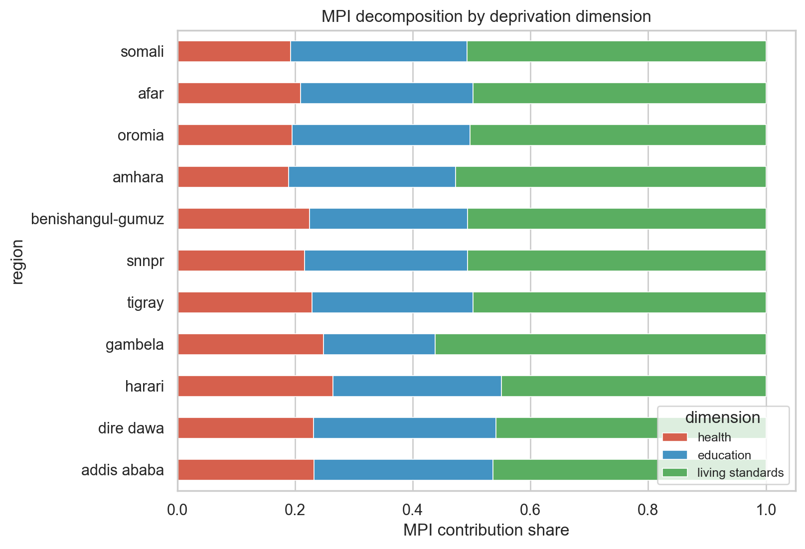
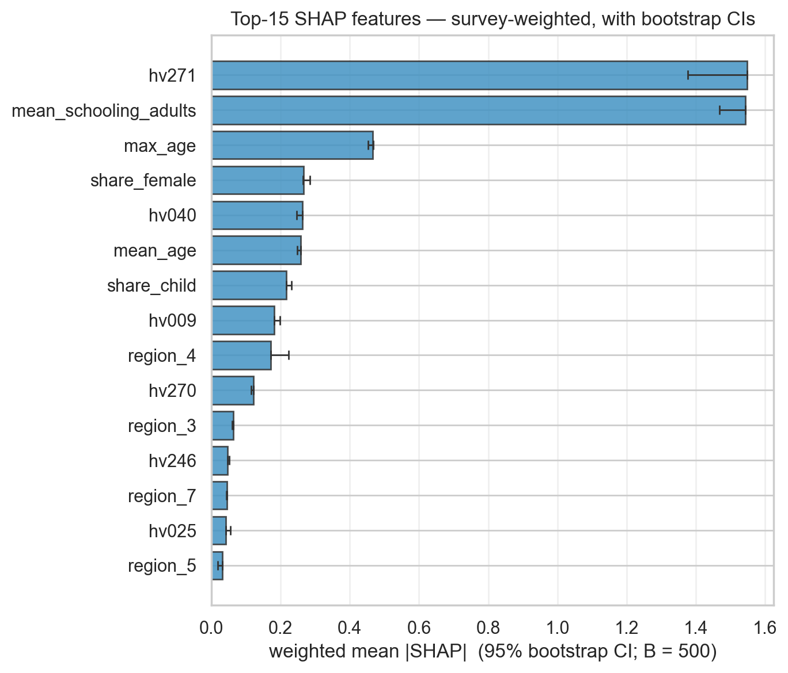
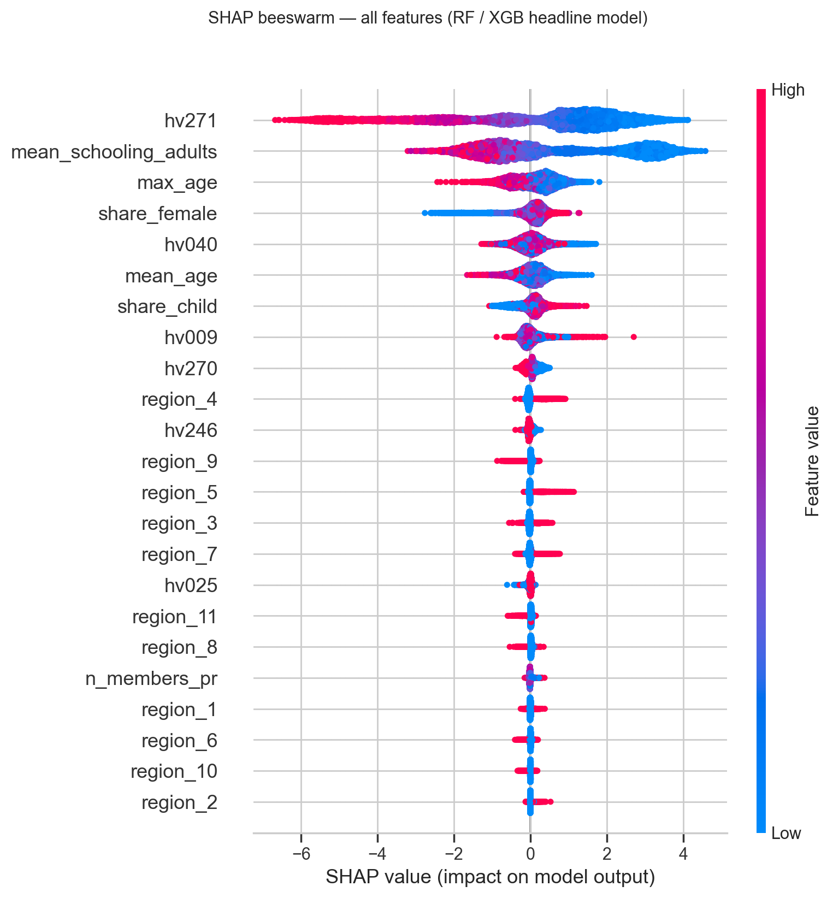

# Multidimensional poverty in Ethiopia, 2019

**A faithful reproduction of the OPHI Global MPI on DHS 2019, decomposed by region and dimension, with a descriptive machine-learning overlay and a six-axis robustness check.**

*Muhanad Husn — analytic report based on the [Multidimensional-poverty-in-Ethiopia](https://github.com/Muhanad-husn/Multidimensional-poverty-in-Ethiopia) repository.*


*Figure 1. Regional MPI for Ethiopia (DHS 2019), with a green square at each region's centroid marking the dimension that contributes the largest share of MPI in that region. In every region, that dimension is living standards.*

---

## 1. The question I set out to answer

A household in eastern Somali region with two children, no formal schooling between them, a pit latrine, kerosene for cooking, and walls of unfired brick is not "almost the same as" a household two regions away in Addis Ababa with a wage earner, a finished floor, and electric lighting. An income line that puts them within a few hundred birr of each other does not capture that gap, and in lower-resource settings the income line miscounts in both directions: subsistence agriculture is undercounted, and non-monetary deprivations (clean water, school attendance, child mortality, electricity) never appear in it at all.

The OPHI Global Multidimensional Poverty Index, adopted by UNDP, asks a different question. Across health, education, and living standards, how many *deprivations* does a household face, how intense is that bundle, and what share of households cross a poverty threshold defined on the bundle rather than on income?

I set out to answer three questions for Ethiopia using the most recent DHS wave (2019):

1. **What is the OPHI MPI for Ethiopia in 2019, computed correctly through the DHS survey design?**
2. **How does it decompose by region and by deprivation dimension, and which dimension does the most work in which region?**
3. **Which household characteristics most associate with MPI status, when the OPHI indicators themselves are hard-excluded from the feature set?**

A note on what this is not, before anything else. This is not a cross-country comparison; harmonized cross-country MPI is a separate exercise. This is not a poverty-targeting tool; operationalising any of these estimates into targeting requires program design, harms analysis, and ethics review I did not perform. The machine-learning overlay is descriptive feature importance, not causal. SHAP attributions tell me which features the classifier uses to discriminate poor from non-poor, not what causes poverty.

## 2. Data

The analysis sits on three sources. **DHS Ethiopia 2019** (registered-access microdata; the license forbids redistributing the raw recodes) supplies household, member, and births records with the full survey design (cluster IDs, strata, and sampling weights) that any nationally representative estimate requires. **OPHI's Global MPI methodology** supplies the 10 indicators, the three equally weighted dimensions, the indicator weights, and the poverty cutoff k = 1/3. **GADM 4.1** supplies the admin-1 (region) polygons for the map, crosswalked to DHS region codes inside the project's data loader.

After the lean column load (the raw HR recode is roughly 1,400 columns wide; I pull only the union of what the MPI engine and the ML feature set need), the working shapes are 8,663 households, 40,659 person-level records, and 23,007 birth records.

The repository does not commit the raw DHS files. It commits a PII-free derived export at `data/processed/households_mpi.parquet` (51 KB) containing the 10 OPHI indicators, the deprivation score, the poverty flag, the censored score, and the design columns. That is enough to reproduce the robustness notebook end-to-end without DHS registration. To rebuild from scratch, a reader registers with DHS, drops the recodes into `data/raw/`, and re-runs.

## 3. Method

The OPHI MPI is a three-step recipe, and each step is a small but real decision.

**Build the 10 indicators per household.** For health, nutrition (any eligible member underweight, stunted, or wasted) and child mortality (any child has died, the classic OPHI rule `b5 == 0`); for education, years of schooling and school attendance; for living standards, six items covering cooking fuel, sanitation, drinking water, electricity, housing, and assets. The 10 indicators are constructed from HR (living standards plus the design columns), PR aggregated up to the household (nutrition, schooling, attendance), and BR (child mortality).

**Compute the weighted deprivation score.** OPHI weights each dimension equally at 1/3, then splits each dimension equally across its constituent indicators: 1/6 each for the two health and two education indicators, 1/18 each for the six living-standards indicators. The score sums these. A household is "multidimensionally poor" when the score reaches the OPHI cutoff k = 1/3.

**Aggregate, through the survey design.** Headcount H is the survey-weighted share of households that are poor. Intensity A is the average score *among the poor*. MPI = H × A. Every aggregate (national, regional, by dimension) runs through `svy 0.18.1`, the maintained Python successor to `samplics`, with sampling weights (`hv005`/1e6), strata (`hv022`), and clusters (`hv021`) carried through and Taylor-linearised variance for the standard errors.

Onto that I layered two extensions. The first is the **decomposition**: for each indicator j, the censored headcount h_j is the survey-weighted share of households that are MPI-poor *and* deprived in j, and MPI = Σ_j w_j × h_j. Aggregating those contributions by dimension tells me which dimension is doing the most work, regionally. The second is the **ML overlay**: an XGBoost classifier predicts MPI status from a wider household feature set, with the 10 OPHI indicators hard-excluded by assertion at feature-matrix construction (`AssertionError` if any of them slips in), cross-validated with `GroupKFold` grouped on the DHS cluster `hv001`, and summarised with sampling-weight-aware SHAP.

The strongest critique of all of this is that the OPHI weighting and the k threshold are themselves choices. Different reasonable choices give different headlines. So sensitivity to both, plus four other load-bearing decisions, is shown explicitly in `notebooks/03_robustness.ipynb`. I'll come back to that.

## 4. Findings

The headline is short, and it lands hard.

**National MPI = 0.385**, 95% CI [0.362, 0.408]. The headcount H = 70.9%, meaning roughly seven in ten Ethiopian households are multidimensionally poor on OPHI's definition. The average intensity among the poor is A = 0.544, meaning the average poor household is deprived in slightly more than half of the weighted indicators. The complete-case scoring rests on 5,529 households; the available-case sensitivity (every household scored, weights renormalised over observed indicators) gives 0.377, within a percentage point of the headline.

**Regional MPI ranges from 0.540 in Somali to 0.056 in Addis Ababa**, close to a tenfold spread across the country's eleven first-level regions. Somali, Afar, Oromia, Amhara, Benishangul-Gumuz, and SNNPR (the predominantly rural and pastoral regions) cluster between MPI = 0.38 and 0.54. Tigray sits in the middle at 0.328. Gambela, Harari, and Dire Dawa cluster between 0.19 and 0.28. Addis Ababa is an outlier at the bottom, an order of magnitude below the worst-off region.

**Living standards dominates in every region.** Nationally, living standards contributes about 50% of MPI; education contributes around 30%, and health around 20%. The pattern is remarkably consistent across the regional decomposition: in every region the green segment in Figure 2 is the largest one. That is the empirical content of the green-square overlay in Figure 1. The dominant deprivation dimension is the same everywhere in Ethiopia. What varies between regions is *intensity*, not *composition*.


*Figure 2. MPI contribution shares by dimension, by region. Red = health, blue = education, green = living standards. Living standards is the largest contributor in every region; education's share is slightly larger in the urbanised Harari, Dire Dawa, and Addis Ababa.*

**Honouring the survey design matters quantitatively, not just in principle.** A naive estimator that ignores weights, strata, and clusters gives MPI = 0.369 with SE = 0.0038. The correctly designed estimator gives MPI = 0.385 with SE = 0.0117. The point estimate moves by 1.6 percentage points, and the standard error inflates by 3.0×. The naive confidence interval is not just narrower; it is wrong, because it pretends the 8,663 households are independent when they sit inside 305 clusters whose members share local infrastructure, water sources, schools, and markets.

**The ML overlay reaches AUC = 0.93** (XGBoost, GroupKFold on `hv001`, 5 folds), and the SHAP top features are exactly what the household-economics literature predicts. `hv271` (the DHS wealth factor score) and `mean_schooling_adults` lead by a clear margin, with `max_age`, `share_female`, `hv040` (altitude), `mean_age`, and `share_child` following. The wealth-index dominance is the empirical signature of the **partial circularity** I document as Decision 5: `hv271` is constructed from many of the same asset and housing items that feed the OPHI living-standards indicators, and the wealth-dropped re-run (§5 below) quantifies how much of the AUC is wealth alone.


*Figure 3. Top-15 SHAP features ranked by survey-weighted mean |SHAP|, with 500-replicate bootstrap 95% CIs. `hv271` (DHS wealth factor) and `mean_schooling_adults` are statistically separated from the rest of the field; the third place onwards is a tightly clustered group.*

## 5. The robustness story: does the headline survive?

The headline rests on six load-bearing decisions, every one of which could have been made differently. I won't pretend they couldn't. Below I report what happens when each is varied.

**The poverty cutoff k.** The OPHI default is 1/3. I re-ran at k = 0.20 and k = 0.50. National MPI moves by construction (0.426 → 0.385 → 0.268 as k tightens), which is expected. The question is whether the *regional ranking*, the story the hero figure tells, moves with it. The Spearman rank correlation between k = 1/3 and k = 0.20 is **+0.991**; between k = 1/3 and k = 0.50 it is **+0.955**. The Somali-on-top, Addis-on-bottom story is not k-contingent.

**Missing indicator handling.** This is the load-bearing one. OPHI's complete-case rule drops any household missing one or more indicators. On real DHS Ethiopia 2019 that loss is **not** small: 36.2% of households are dropped, almost entirely because of missing nutrition measurements, with the drop rate ranging 24% (Afar) to 50% (Harari) across regions. The alternative is "available-case": renormalise OPHI weights over the observed indicators and keep every household. I ran both. National MPI moves from 0.385 (drop) to 0.377 (available-case). The Spearman correlation of regional MPI between the two policies is **+0.973**; three out of eleven regions shift rank, and the largest absolute rank shift is two positions (SNNPR drops from rank 4 to rank 6 under available-case; Benishangul-Gumuz and Amhara each shift by one). The regional ranking survives the policy switch, but barely enough that I treat the available-case version as a co-finding rather than a footnote.

**Cluster-respecting cross-validation.** The argument from first principles is that DHS clusters are spatially contiguous, so a random `KFold` lets the model train on the test-set environment and over-states test performance. The argument from the data is that, on this particular feature set, the random-vs-clustered AUC gap is **+0.001**, which is small. The rule still applies, because (a) the same model on a different feature set could open that gap up, and (b) the leave-one-region-out stress test, where the model trains on ten regions and is evaluated on the eleventh held-out region, gives AUC ranging from 0.818 (SNNPR held out) to 0.957 (Afar held out), with a mean of 0.908 and a standard deviation of 0.043. The worst-case region-transfer story is materially worse than the headline AUC, and that is the cost the GroupKFold rule was guarding against.

**Wealth-index circularity.** The DHS wealth index (`hv270` quintile, `hv271` continuous factor score) is constructed from many of the same asset and housing items that feed the OPHI living-standards indicators. Including wealth is partially circular; excluding it is the cleaner experiment. The headline keeps wealth in because dropping the most-used poverty proxy in the DHS literature is the larger lie. **Wealth-dropped AUC = 0.914**, a delta of **−0.020** from the headline's 0.934. With wealth gone, `mean_schooling_adults` rises to the top of the SHAP table, `hv025` (urban/rural) jumps to rank 2, and altitude, mean_age, and max_age fill in the next three slots. The classifier finds most of the signal without the wealth shortcut, which is the empirical content of the circularity caveat.

**SHAP aggregation with sampling weights.** A national feature-importance claim has to use the DHS weights, because households are sampled with unequal probability by design (urban over-sampled, sparse strata over-sampled). The Spearman correlation between weighted and unweighted mean |SHAP| on the top-15 features is **+0.968**, and the top-5 weighted and top-5 unweighted are an exact 5/5 overlap. The 500-replicate bootstrap CIs (Figure 3) are tight relative to the gaps between adjacent features, except in the closely matched top two: `hv271` and `mean_schooling_adults` are statistically a tie for the top slot, with `mean_schooling_adults` numerically a hair behind. I report this as a tie, not as a strict 1-vs-2 ordering.

**The full uncapped SHAP plot** (Figure 4) lets the reader see direction-of-effect, not just magnitude. High `hv271` (wealthier households) pulls predictions down (the red dots sit on the left of zero); high `mean_schooling_adults` does the same. High `hv040` (altitude) and `share_female` push predictions up. The pattern beyond rank 8 is thin, which is why I capped the headline table at 15.


*Figure 4. Full SHAP summary (beeswarm). One row per feature, one dot per household; x-axis is signed SHAP value; color is feature value. The headline top-15 captures the substantive distributional signal; the region dummies below `region_4` carry mostly noise.*

What does this whole robustness ledger mean in practice? **The Somali-highest, Addis-lowest headline survives every check.** Living standards dominates in every region under every variation. The XGBoost AUC is well-supported. The two findings I'd qualify rather than retract are (a) the strict 1-vs-2 SHAP ordering at the top, which the bootstrap CIs collapse to a tie, and (b) the LOO-region spread, which says the global classifier does not transport equally well to every held-out region. The SNNPR case at AUC = 0.818 is the worst.

## 6. What I learned, by building this

A few craft observations from the project that a reviewer can audit against the notebooks.

**The cost of an undocumented load-bearing decision is catastrophic; the cost of an extra decision block is tiny.** The repo's notebook discipline pays off most when the missingness drop comes out at 36%. Every meaningful data-processing choice gets a five-part block (problem / diagnostic / options / decision / sensitivity) inline, immediately before the code that implements it. Without the diagnostic, "drop incomplete households" reads as ceremony; with the diagnostic, it reads as a known load-bearing concession that earns the available-case sensitivity check. The whole rationale for the OPHI standard, which is cross-country comparability, has to be weighed against a 36% sample loss, and a reader who is going to disagree with me can do so on visible evidence.

**Survey design is a correctness requirement, not a tunable choice.** The diagnostic was the cleanest thing in the project: a single side-by-side table showing naive MPI = 0.369 with SE = 0.0038 vs `svy` MPI = 0.385 with SE = 0.0117. The standard error is 3× understated and the point estimate moves by 1.6 percentage points if you ignore the design. The argument doesn't get cleaner than that. It justifies the deviation from the original implementation plan (which named `samplics`, now archived) toward `svy 0.18.1`, the maintained continuation by the same author, with the same Taylor-variance estimation core, Python-native.

**"Honest descriptive feature importance" beats "purified feature importance."** I considered dropping the DHS wealth index from the ML feature set because of the partial circularity with the OPHI living-standards items. I kept it in. The classifier's signal includes wealth-from-assets, and that is the actual empirical structure of household poverty in DHS data: `hv271` is constructed from a superset of the OPHI living-standards items and recovers most of the predictive signal. Pruning that out would have produced a model that disagrees with the body of DHS poverty literature for purity reasons. Instead, I documented the circularity as Decision 5, hard-excluded only the 10 OPHI indicators themselves by assertion at feature-matrix construction, and ran a wealth-dropped sensitivity that quantified the AUC delta at −0.020. The reader sees both numbers and decides.

**Cluster-respecting CV is justified by worst-case contamination, not by the average-case gap.** On this feature set the random-vs-clustered gap was +0.001. The natural temptation is to conclude that random KFold would have been fine. But the LOO-region stress test, where the model is asked to generalise to a held-out region it has never seen any household from, shows AUC dropping to 0.818 in the worst case. That *is* the kind of contamination GroupKFold guards against. The rule applies because the worst case justifies it.

## 7. Limitations and honest gaps

A short list of what this work does not establish.

This is one DHS wave. DHS Ethiopia is roughly five-yearly; 2019 pre-dates the Tigray war (2020–2022), severe drought episodes in the Horn, and the conflict-driven displacement of recent years. Findings should be read in that frame and not extrapolated to the present.

The OPHI methodology choices are inherited, not data-driven. Ten indicators, three equally weighted dimensions, k = 1/3: these are value judgements OPHI made for cross-country comparability, and the project adopts them deliberately. Different reasonable weightings would give different headlines.

Child mortality follows the classic OPHI "any child has died" rule (`b5 == 0`), not the revised 5-year-window / under-18 restriction OPHI publishes elsewhere. The deviation is documented; it would require additional BR columns to stress-test.

The ML overlay is descriptive feature importance, not causal. SHAP attributions tell me which features the classifier uses to discriminate poor from non-poor; they are not effect sizes and do not licence "feature X causes poverty" claims.

The wealth-index partial circularity is real and documented. The wealth-dropped sensitivity (§5) quantifies it, and I think the right reading is that the classifier rediscovers the DHS wealth index as a poverty discriminator, which is unsurprising and on-topic, not a bug.

This is not a poverty-targeting tool. Operationalising any of these estimates into program design requires harms analysis, ethics review, and stakeholder engagement I have not performed and that are explicitly out of scope.

## 8. Reproducibility

The full analysis runs end-to-end on a laptop in well under five minutes for the main notebook and 3 to 10 minutes for the robustness notebook (the XGBoost CV plus the 500-replicate SHAP bootstrap are the slow steps).

```bash
git clone https://github.com/Muhanad-husn/Multidimensional-poverty-in-Ethiopia
cd Multidimensional-poverty-in-Ethiopia
conda activate portfolio       # Python 3.14 with svy + xgboost + shap
pip install -e ".[viz,survey,ml]"

# Place DHS microdata in data/raw/ per data/raw/README.md
# (Raw DHS data is gitignored; license forbids redistribution.)

python notebooks/_build_main.py        # rebuild + execute 02_main.ipynb
python notebooks/_build_robustness.py  # rebuild + execute 03_robustness.ipynb

pytest tests/                          # 37 smoke tests on synthetic fixtures
```

The notebook builders (`_build_main.py`, `_build_robustness.py`) are the source of truth. The `.ipynb` files are regenerated from Python cell lists, then executed inline so cell outputs are committed alongside the source. This makes diffs reviewable and the analysis fully rebuildable from scratch.

## 9. Closing

The single most defensible thing I can say about Ethiopia from this analysis is the most boring one: **whichever way you cut it, living standards is the dimension to fix**. Cooking fuel, sanitation, drinking water, electricity, housing quality, and basic assets are the bundle that drives roughly half of MPI nationally, and the largest contributor in every one of the eleven regions, across every variation of k and missingness handling I tested. The regional ordering is real and tenfold; the survey design moves the standard errors enough to matter; the ML overlay reaches AUC 0.93 with the OPHI indicators hard-excluded, and the wealth-from-assets signal that dominates SHAP is the empirical signature of how DHS measures poverty in the first place. None of that is a targeting recommendation. All of it is a defensible map of where the deprivation sits in 2019.

What I'd build next, given another month: a comparable second wave (DHS Ethiopia 2024, when it lands) to put a time gradient on this snapshot, and a regional drill-down on Somali and Afar that decomposes their living-standards contribution down to the individual indicator level. The framework is built; the next exercise is dynamics.

---

*Code, notebooks, and figures: [github.com/Muhanad-husn/Multidimensional-poverty-in-Ethiopia](https://github.com/Muhanad-husn/Multidimensional-poverty-in-Ethiopia).*
